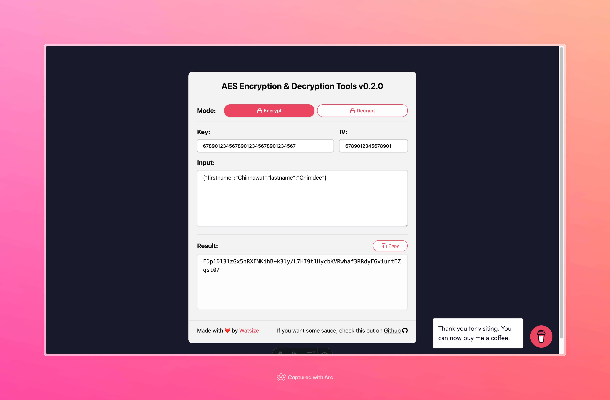

# encrypt-tools

The AES encryption & decryption tools with interactive web-app.

## Table of Contents

- [encrypt-tools](#encrypt-tools)
  - [Table of Contents](#table-of-contents)
  - [📦 Build with](#-build-with)
  - [📋 Features](#-features)
  - [🏷 Version](#-version)
  - [💡 DEMO](#-demo)

## 📦 Build with

- [Astro v6](https://astro.build/)
- [React 19](https://react.dev/)
- [Tailwind CSS v4](https://tailwindcss.com/)
- [Jotai](https://jotai.org/) - State management
- [Radix UI](https://www.radix-ui.com/) - Accessible primitives

## 📋 Features

- AES-CBC Encryption & Decryption by `key` and `iv` with ease
- Base64 auto-detection for Key and IV inputs with manual toggle override
- Web Crypto API powered (no server-side dependency)

## 🏷 Version

- Checkout with [CHANGELOG.md](./CHANGELOG.md)

## 💡 DEMO

- `[moved]` ~~[https://encrypt-tools.vercel.app/encrypt-tools/encrypt](https://encrypt-tools.vercel.app/encrypt-tools/encrypt)~~
- `[new ✨]` [https://encrypt-tools.onrender.com/](https://encrypt-tools.onrender.com/)

> made with ❤️ by buildingwatsize
